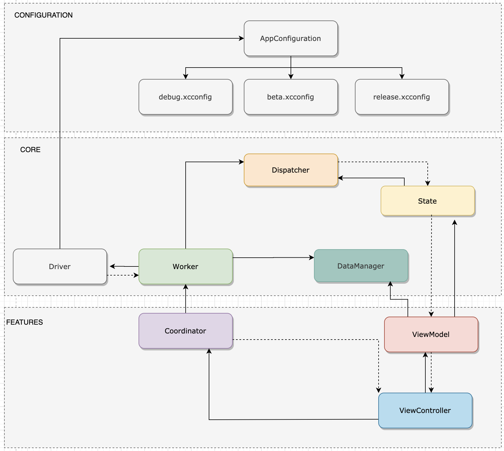
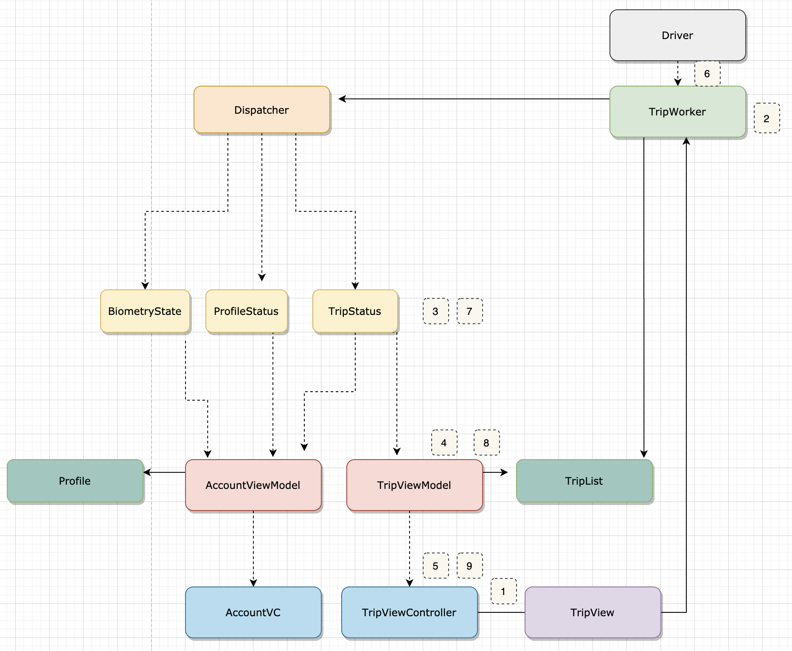
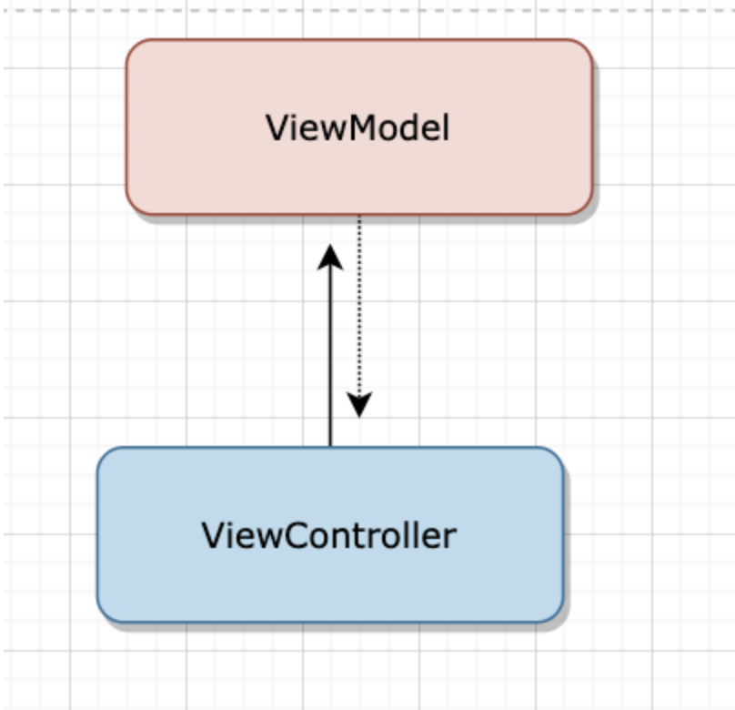
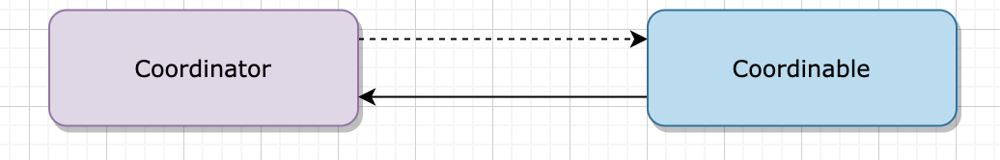
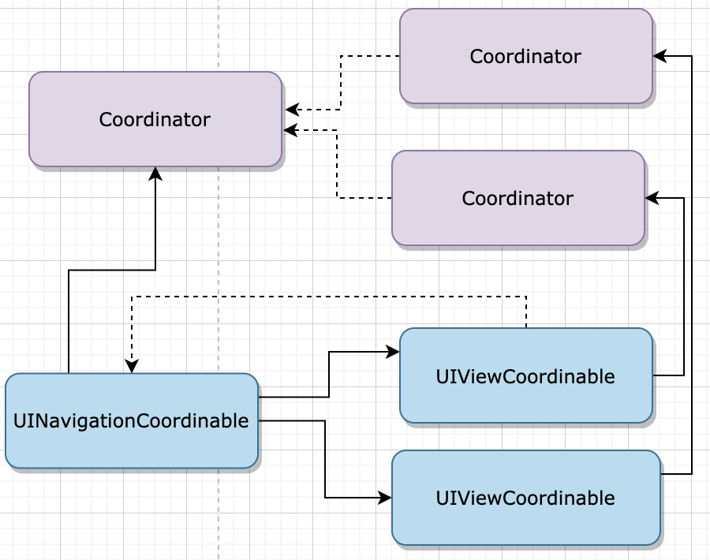
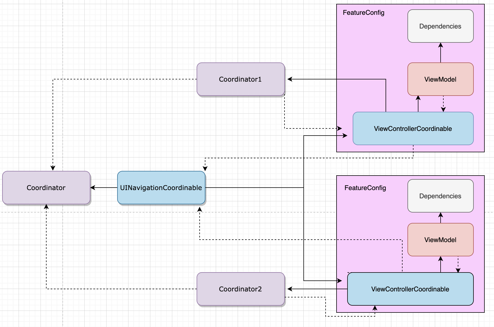
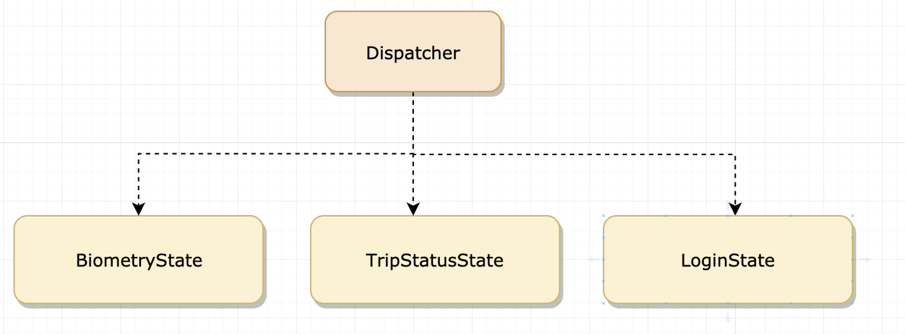
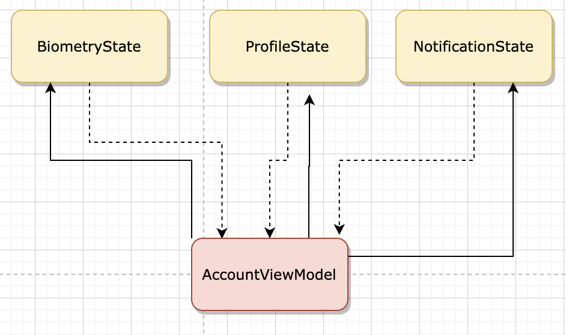
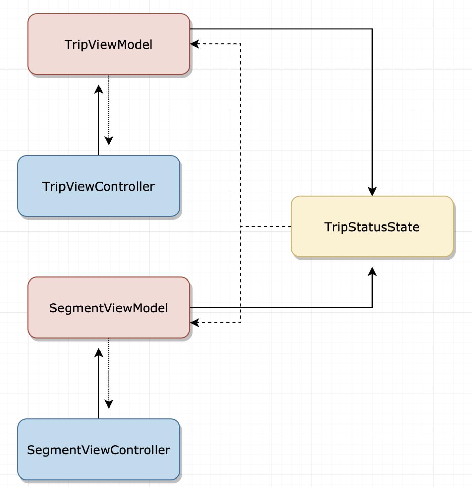
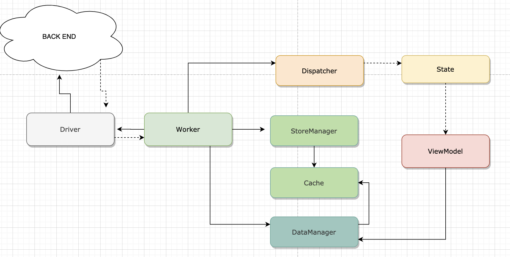

# Architecture

Presentation of the architecture. 
The architecture is inspired by FLUX and VIP architecture. 
This architecture is composed of severals elements :
- ViewModel
- ViewController
- Coordinator
- Dispatcher
- Worker
- State 




## Unidirectional data flow :  



The FLOW is : 

1/ 

    - The user does a pull down to refresh
    - The ViewModel / Coordinator will use a TripWorker to handle that
    
2/ 

    - TripWorker will dispatch first a "beginRefreshTrips
    - TripWorker will use the driver to fetch the new trips 
    - TripWorker wait for the network call back. 
    
3/   

    -  The TripStatus will react to it : isRefreshing is true 
 
 4/
 
    - The TripViewModel update the isStatusRefreshing. 

5/

    - The TripViewController will update the UI and a spinner is here :)

6/ 

    -  TripWorker receive new trip list.
    -  TripWorker store new trip list (using storeManager) on the dataManager.
    -  TripWorker will dispatch first a "endRefreshTrips

7/ 

    - The TripStatus will react to it : isRefreshing is true 
 
 8/
 
    - The TripViewModel update the isStatusRefreshing to false
    - The TripViewModel will fetch on the dataManager the new trip model
 
 9/
 
    - The TripViewController will update the UI and the spinner is gone and the trip has been updated. 

## UIViewController

- Responsible for building the UI 
- ViewController has a ViewModel associated
- ViewController is automatically binded to a ViewModel and update to it 

```swift

class UserViewController: UIViewCoordinable, FeatureViewController {
    typealias ViewModel = UserViewModel
    var viewModel: UserViewModel?
    
    typealias Actions = UserActionProtocol
    var actions: UserActionProtocol?
    
    //@IBOutlet weak var username: UILabel!
    
    // MARK: View lifecycle
    override func viewDidLoad() {
        super.viewDidLoad()
        // navigationItem.title = "Account"
        // username.accessibilityIdentifier = "usernameLabel"
        updateUI()
    }
    
    // MARK: Update logic 
    func updateUI(viewModel: UserViewModel) {
        //username.text = "Welcome \(viewModel.username)"
        //biomeTryLabel.text = viewModel.supportedBiometry.localizedValue
    }

    // MARK: Interaction Logic
    // define here some @IBAction or some interaction between
    // the app and the user
    //
    // see example below
    //
    // @IBAction func didClickOnLogOutButton(sender:Any?){
    //     actions?.logOut()
    // }
}

```

## ViewModel

```swift

protocol UserViewModelProtocol {
    // Here declare variable of the state or object you want observe
    // ----------------------------------------------------------
    //         Variables must be only accessible in read
    // ----------------------------------------------------------
    //
    // See the example below
    //
    // var isRefreshing: Bool { get } // observe refreshing state changement
}

class UserViewModel: FeatureViewModel, UserViewModelProtocol {
    // MARK: uiDelegate
    weak var uiDelegate: UserViewController?
    typealias UIDelegate = UserViewController

    // MARK: Dependencies 
    var dependencies: UserDependenciesProtocol
    required init(deps: UserDependenciesProtocol) {
        self.dependencies = deps
        // Here you can observe dynamic value from state in the core 
        // See the example below
        //
        // dependencies.tripStatus.addObserver(self) { [weak self] in
        //    self?.notify()
        // }
    }

    //
    // var isRefreshing: Bool {
    //      return dependencies.tripStatus.value.isRefreshing
    // }
    // 
}

```
 - A ViewModel is a facade that abstracts the ViewController state from the rest of the application. 
 - A ViewModel can adapt a business model to a ViewController
 - A ViewModel can be binded to severals domain state in the application. 



## Coordinable



A Coordinable is a just a class that inherit from UIViewController and has a strong reference to the coordinator. 

```swift

// Coordinable are the only structure that keep strong reference on coordinators. 
// The coordinator here is optional because we can not override properly init method in UIViewController. 
protocol Coordinable {
    var coordinator: Coordinator? { get set }
}

class UIViewCoordinable: UIViewController, Coordinable {
    var coordinator: Coordinator?
}
```
### UINavigationCoordinable



```swift
// Allow to push directly coordinator and the component will handle the memory management based on UIKit directly
extension Coordinable where Self: UINavigationController {
    func navigate(to child: Coordinator, animated: Bool) {
        child.parentCoordinator = coordinator
        var vc = child.buildUI()
        vc.coordinator = coordinator
        pushViewController(vc, animated: true)
    }
    
    static func build(coordinator: Coordinator, child: Coordinator) -> Self {
        var nav = Self()
        nav.coordinator = coordinator
        child.parentCoordinator = coordinator
        let vc = child.buildUI()
        nav.viewControllers = [vc]
        return nav
    }
}

class UINavigationCoordinable: UINavigationController, Coordinable {
    var coordinator: Coordinator?
}

```
### UITabBarCoordinable

```swift


// Example with the TabBarCoordinable 
struct Tab {
    let coordinator: Coordinator
    let id: TabType
    let label: String?
}

extension Tab {
    var tabBarViewController: UIViewController {
        let view = coordinator.buildUI()
        view.tabBarItem.title = self.label
        return view
    }
}

class UITabBarCoordinable: UITabBarController, Coordinable {
    var coordinator: Coordinator?
    
}

extension Coordinable where Self: UITabBarController {
    static func build(coordinator: Coordinator, tabs: [Tab]) -> Self {
        var tabBar = Self()
        tabBar.coordinator = coordinator
        for tabItem in tabs {
            tabItem.coordinator.parentCoordinator = coordinator
        }
        tabBar.viewControllers = tabs.map{ $0.tabBarViewController }
        return tabBar
    }
}

```



Coordinator has severals goals 

- Configuration :  Load a ViewController with a ViewModel and bind them together automatically using typealias
- Actions & Navigation : the ViewController will use the actions fields to call the actions. 
The actions are declared in the Coordinator
- The Coordinator keep a weak reference to the UIViewController (UIViewController or UINavigationController)

### Implementation 

```swift
// MARK: Dependencies
// Specify here the dependencies
protocol UserDependenciesProtocol {
    // here define all dependencies form the core
    //
    // see the example below
    //
    // var dataManager: DataManager { get }
}
class UserDependencies: UserDependenciesProtocol {
    // see the example below
    //
    // @Inject var dataManager: DataManager
}

// MARK: Actions
// Specify here the actions
protocol UserActionProtocol {
    // here define all managment of interaction between
    // the controller and the User action
    //
    // see the example below
    //
    // func logOut()
}
extension UserCoordinator: UserActionProtocol {
    // here implement every actions you define above
    //
    // see the example below
    //
    // func logOut() {
    //   // call what you need
    //   someWorker.logOut()
    // }
}


// MARK: Coordinator
class UserCoordinator: Coordinator, CoordinatorConfig {
    // Configuration
    typealias Deps = UserDependenciesProtocol
    typealias ViewController = UserViewController
    typealias ViewModel = UserViewModel
    typealias Actions = UserActionProtocol

    weak var parentCoordinator: Coordinator?

    // Keep a weak reference to the coordinable object to have action on the UI.
    weak var vc: UIViewCoordinable?

    func buildUI() -> (UIViewController & Coordinable) {
        let dependencies = UserDependencies()
        let vc = UserCoordinator.configure(deps: dependencies, coordinator: self)
        vc.coordinator = self
        self.vc = vc
        return vc
    }
}

 ```

## Dispatcher

- Singleton in the app.
- Central bus in the app that track all the event that can cause an change in the app. 



### Event 

```swift
enum Event: String {
    case beginRefreshData
    case endRefreshData
}
```

### Implementation

 The current implementation of the Dispatcher use NotificationCenter to post and observe event.

```swift

private extension Event {
    var notificationName: Notification.Name {
        return Notification.Name(rawValue: self.rawValue)
    }
}

class Dispatcher {
    func post(event: Event, userInfo: [AnyHashable: Any]? = nil) {
        NotificationCenter.default.post(name: event.notificationName, object: nil, userInfo: userInfo)
    }
    
    func listen(_ observer: Any, event: Event, selector: Selector) {
        NotificationCenter.default.addObserver(observer, selector: selector, name: event.notificationName, object: nil)
    }
    
    func stopListening(_ observer: Any) {
        NotificationCenter.default.removeObserver(observer)
    }
}
```

## Domain States

- Some States are gloabals : there are shared accross the app. 
- ViewModels can be the combinaison of severals Global state :  Example : AccountViewModel can be the combinaison of ProfileState, BiometryState... 
- TripStatus is good example. TripStatus show the pulldown to refresh in severals views.
SegmentViewModel, TripViewModel use the same TripStatus global state.

### Implementation 


- DynamicValue is a observableWrapper of any kind of object
- DynamicValueModifier is a protocol that allow the class to modify DynamicValue objects

```swift

typealias CompletionHandler = (() -> Void)

class DynamicValue<T> {
    fileprivate(set) var value : T {
        didSet {
            self.notify()
        }
    }

    private var observers = [String: CompletionHandler]()

    init(_ value: T) {
        self.value = value
    }

    public func addObserver(_ observer: AnyObject, completionHandler: @escaping CompletionHandler) {
        observers[observer.description] = completionHandler
    }

    fileprivate func notify() {
        observers.forEach({ $0.value() })
    }

    deinit {
        observers.removeAll()
    }
}

protocol DynamicValueModifier {
    func setValue<T>(_ dynamicValue: DynamicValue<T>, value: T)
}

extension DynamicValueModifier {
    func setValue<T>(_ dynamicValue: DynamicValue<T>, value: T) {
        dynamicValue.value = value
    }
}
```

- isRefreshing variable is a readonly variable from outside the TripStatus component
- TripStatus listen evens of the dispatcher and update to it. 

 ```swift

 class TripStatus: DynamicValueModifier {
     var isRefreshing: DynamicValue<Bool> = DynamicValue(false)
     
     private var dispatcher: Dispatcher
     init(dispatcher: Dispatcher) {
         self.dispatcher = dispatcher
         dispatcher.listen(self, event: .beginRefreshTrips, selector: #selector(self.beginRefreshTrips(_:)))
         dispatcher.listen(self, event: .endRefreshTrips, selector: #selector(self.endRefreshTrips(_:)))
     }
     
     @objc private func beginRefreshTrips(_ notification: Notification) {
         setValue(isRefreshing, value: true)
     }
     
     @objc private func endRefreshTrips(_ notification: Notification) {
          setValue(isRefreshing, value: false)
     }
     
     deinit {
         self.dispatcher.stopListening(self)
     }
 }

 ```

### State/ViewModel



```swift

//
//  GBTAccountViewModel.swift
//  IOSArchitecture
//
//  Created by Benjamin LORENZI on 08/03/2020.
//  Copyright © 2020 Benjamin LORENZI. All rights reserved.
//
import UIKit

protocol GBTAccountViewModelProtocol {
    var username: String { get }
    var biometryEnabled: Bool { get }
    var supportedBiometry: BiometryType { get }
}

class GBTAccountViewModel: FeatureViewModel, GBTAccountViewModelProtocol {
    weak var uiDelegate: GBTAccountViewController?
    typealias UIDelegate = GBTAccountViewController
    
    // Dependencies
    
    var dependencies: GBTAccountDependenciesProtocol
    required init(deps: GBTAccountDependenciesProtocol) {
        self.dependencies = deps
        dependencies.profileStatus.addObserver(self) { [weak self] in
            self?.notify()
        }
        dependencies.biometryState.addObserver(self) { [weak self] in
            self?.notify()
        }
    }
    
    // Business Model
    var profile: Profile? {
        return dependencies.profile
    }
    // Computed Properties
    var username: String {
        return profile?.username ?? ""
    }
    var biometryEnabled: Bool {
        return dependencies.biometryState.value.enabled ?? false
    }
    var supportedBiometry: BiometryType {
        return dependencies.biometryState.value.supportedBiometry ?? .none
    }
}


 ```
 
###  State/ViewModel/ViewController




## Workers 



- Workers are process that can post severals events in the dispatcher
- BaseNetWorker is Worker that call the driver.


```swift

class BaseNetWorker {
    var dispatcher: Dispatcher
    var driver: Driver
    var dataManager: DataManager
    var storeManager: StoreManager<ModelsStored>
    init(dispatcher: Dispatcher = DependenciesManager.main.dispatcher, driver: Driver = DependenciesManager.main.driver, dataManager: DataManager = DependenciesManager.main.dataManager, storeManager: StoreManager<ModelsStored> = DependenciesManager.main.storeManager) {
        self.dispatcher = dispatcher
        self.driver = driver
        self.dataManager = dataManager
        self.storeManager = storeManager
    }
    
    deinit {
        self.dispatcher.stopListening(self)
    }
}

class ProfileWorker: BaseNetWorker {
    
    func fetchProfileOnce(completion: @escaping (_ profile: Profile?, _ error: NSError?) -> Void ) {
        guard dataManager.profile == nil else {
            self.dispatcher.post(event: .endProfileFetched)
            completion(nil,nil)
            return
        }
        refreshProfile(completion: completion)
    }
    
    func refreshProfile(completion: @escaping (_ profile: Profile?, _ error: NSError?) -> Void ) {
           dispatcher.post(event: .beginProfileFetched)
           driver.getProfile() { profile, error in
               self.storeProfile(profile)
               completion(profile,error)
           }
       }
}

private extension ProfileWorker {
    func storeProfile(_ profile: Profile?) {
        guard let profile = profile else {
            return
        }
        storeManager.cache.profile = profile
        storeManager.saveCache()
        dispatcher.post(event: .endProfileFetched)
    }
}
```
